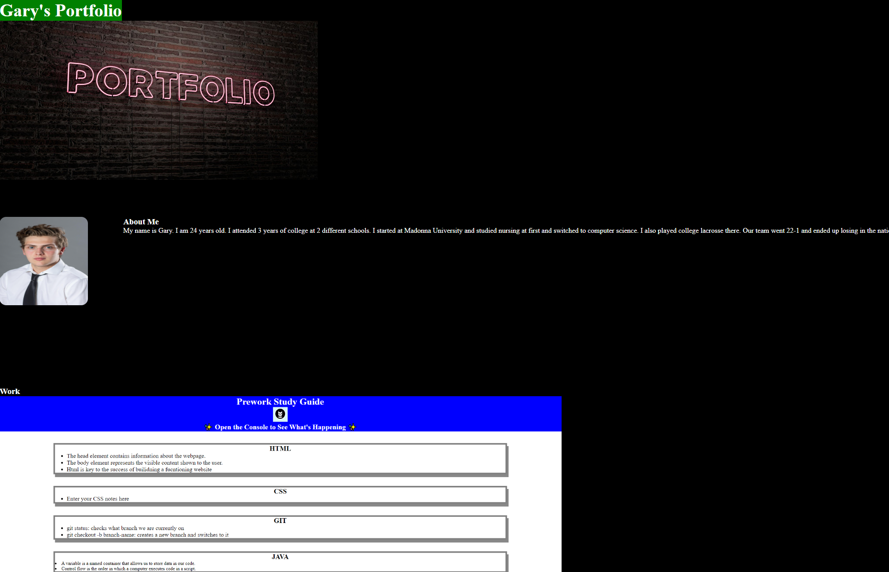

# Student Portfolio

## Purpose of website
The purpose of this website is to create a basic portfolio. I added sections About me, Work, Contact me, and resume which doesn't exist yet 

## about me

this is a shoet story of me so you can understand a little of my past. I added styling to this so about me info will be below the image when youshrink the screen  

## work
this is work I have done so far in the class. each image has a link to a deployed site. 

## contact me 
this is my contact info. each contact has a link that works. Phone, Email, and GitHub

## Link to depolyed application 
https://garycutler.github.io/Student-Portfolio/

## Website image 
